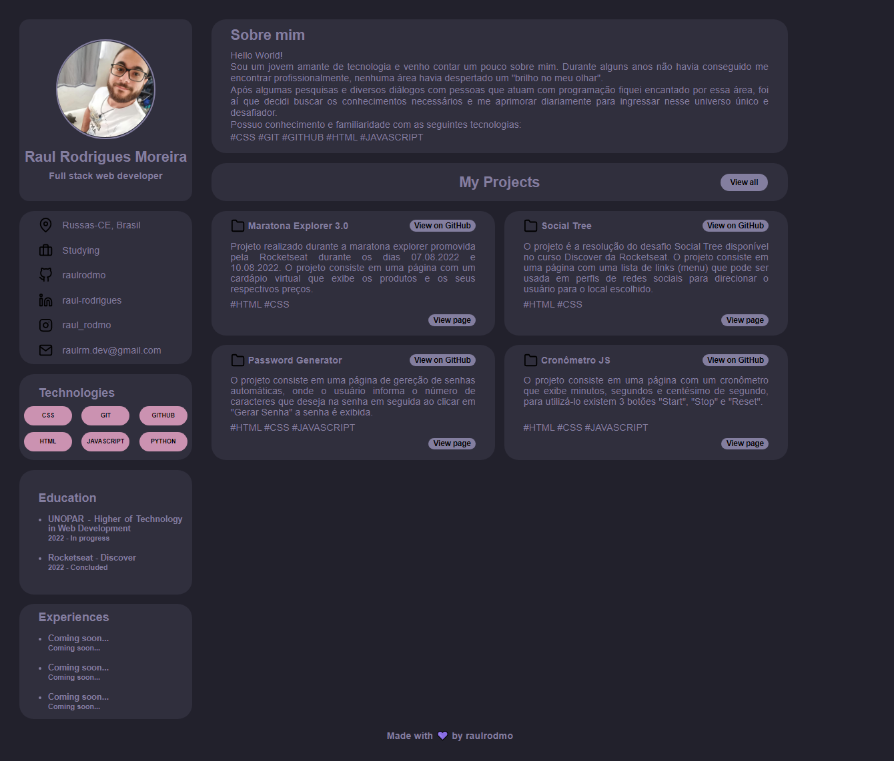

<h1 align="center"> Portfólio </h1>

Repositório feito com base no desafio Portfólio encontrado no curso Discorver da Rocketseat.  

  <a href="#technologies">Technologies</a>&nbsp;&nbsp;&nbsp;|&nbsp;&nbsp;&nbsp;
  <a href="#project">Project</a>

 

  

## 🚀 Technologies

Esse projeto foi desenvolvido com as seguintes tecnologias:

- HTML e CSS
- Git e Github

## 💻 Project

O projeto consiste em uma página para exibir meu portfólio com os principais projetos desenvolvidos ao longo da minha caminhada.

- [Visite o projeto online](https://portfolio-raulrodmo.netlify.app//)

---

Made with 💜 by raulrodmo

